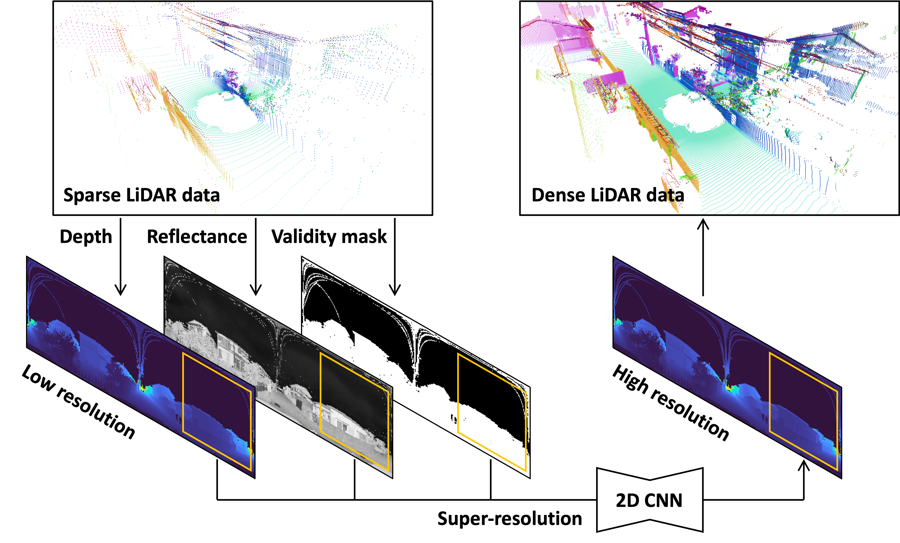

# depth-image-super-resolution-for-LiDAR-data
LiDAR 点群アップサンプリングのための欠損と反射率を考慮した深度マップ超解像

This is my exchange project at Kyushu University during 2019-2020. Due to the low number of fero lidar rays, the collected data has a sparse point cloud, which is not conducive to subsequent analysis. Considering the correspondence between point clouds and depth images and the rapid progress in the field of image super-resolution, we creatively improved the results of sampling on 3D point clouds by combining 2D image super-resolution networks with 3-dimensional loss, using both reflectance images and LR masks.

